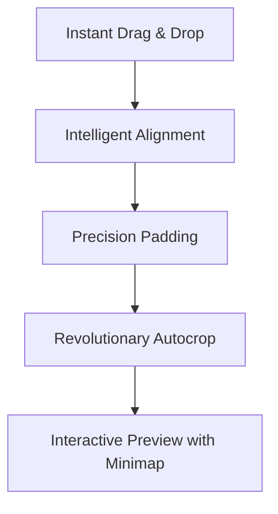

# Promotional Walkthrough: ImaJoin

This document serves as the foundation for creating a promotional minisite (landing page) or scripting a product introduction video for **ImaJoin**.

---

## 🎯 Brand Identity

### 💡 Suggested Payoffs (Choose your preferred option)
1. **"ImaJoin: Merge your images. Keep transparency. Align to perfection."** (Focuses on technical precision)
2. **"ImaJoin: Pixel-perfect image stitching for macOS developers and designers."** (Focuses on target professional audience)
3. **"Drag, merge, and crop. Your images, aligned instantly."** (Focuses on ease of use and simplicity)

### 🧠 The Reason Why (Why ImaJoin?)
Combining sprites, UI mockups, or transparent icons is a tedious process in Photoshop or Figma that takes too much time, ruins layout margins, and requires annoying manual calculations to avoid misalignment or to crop invisible transparent borders.
**ImaJoin solves this at the root.** It lets you drag and drop your images, sort them automatically, adjust pixel-level padding (including negative overlapping), and automatically crop invisible transparent edges in one click, all while offering an interactive high-fidelity preview with contrast controls. It is the ultimate utility to optimize your graphic production workflow on macOS.

---

## 🚀 The 5 Keypoints of the Application

### 1. Instant Drag, Drop & Sort
- **How it works**: Drag files directly from Finder into the drop zone.
- **The benefit**: The app automatically sorts them alphabetically by filename, ensuring a predictable and structured output in less than a second.

### 2. Intelligent Bidirectional Joining
- **How it works**: Choose between horizontal and vertical layouts.
- **The benefit**: If images have different dimensions, ImaJoin automatically calculates the ideal canvas size and centers them perfectly, eliminating manual adjustments.

### 3. Pixel-Level Padding Control
- **How it works**: A precision slider lets you set spacing between images from `-500px` to `+500px`.
- **The benefit**: Negative spacing values allow images to overlap, which is perfect for compacting sprite sheets or creating unique overlapping graphics.

### 4. Automatic Alpha Autocrop
- **How it works**: The algorithm inspects the alpha channel and extracts the smallest bounding box containing visible pixels (`alpha > 0`).
- **The benefit**: Eliminates empty transparent space before performing layout calculations. It preserves Retina display quality (`@2x` sizes) and falls back safely if an image is completely blank.

### 5. Interactive Live Preview
- **How it works**: An independent preview window featuring trackpad-native pinch-to-zoom and panning gestures.
- **The benefit**:
  - **Minimap Viewport**: A mini overview with a red viewport tracker highlights exactly what part of large canvases you are viewing.
  - **Contrast Backgrounds**: Instantly swap backgrounds between Transparent Grid (Checkerboard), Solid White, and Solid Black to inspect transparency edges.

---

## 🎬 Promotional Video Script Structure (30-Second Outline)

| Time | Visual Scene (What to show) | Voiceover / On-screen Text (What to say) |
|---|---|---|
| **0:00 - 0:05** | User launches ImaJoin. Drags 5 transparent PNG icons into the drop area. | *"Tired of wasting time manually aligning sprites and mockups in bloated graphics software?"* |
| **0:05 - 0:12** | Switch between Horizontal and Vertical modes. The layout updates instantly in the preview. | *"Meet ImaJoin. Drag your files, pick your layout orientation, and they align perfectly in an instant."* |
| **0:12 - 0:18** | The new **Autocrop** toggle is switched on. Empty margins disappear, and assets snap closer together. | *"Turn on automatic Autocrop to trim away invisible transparent margins instantly, preserving native Retina scale."* |
| **0:18 - 0:24** | Zooming into the preview, switching backgrounds (Checkerboard -> Black), and tracking the viewport on the Minimap. | *"Inspect every single pixel using smooth zoom, a viewport-tracking minimap, and high-contrast background toggles."* |
| **0:24 - 0:30** | Saving the file and showing the generated `_join.png` ready in Finder. Final logo and payoff screen. | *"Save to lossless transparent PNG and keep creating. ImaJoin: Align to perfection, instantly."* |

---

## 🌐 Promotional Minisite Structure (Landing Page)

### 🧭 Hero Section (First Fold)
- **Catchy Headline**: "Stitch Sprites and Merge Images on macOS, Effortlessly."
- **Supporting Paragraph**: "Pixel-perfect alignment, dynamic padding control, smart transparency autocropping, and live preview with minimap tracking. All in a sleek, native Mac utility."
- **Call to Action**: Premium "Download Now" or "Get it on the Mac App Store" button.
- **Visual Asset**: A graphic illustration/video showing the drag-drop workflow and final joined result.

### 📐 Features Grid (2x2 Layout)
- **Card 1: Smart Alignment**: "Automatic center alignment and canvas adjustments for horizontal and vertical layouts."
- **Card 2: Alpha Autocrop**: "No more blank transparent margins. ImaJoin detects real pixels and trims the rest."
- **Card 3: Dynamic Spacing**: "Control padding to the pixel. Negative values supported for overlapping layouts."
- **Card 4: Pro-Grade Inspection**: "Check edge transparency on transparent grid, white, or black background colors with live zoom."

### 📢 Footer / Final Call to Action
- **Closing Payoff**: *"ImaJoin: Align to perfection, instantly."*
